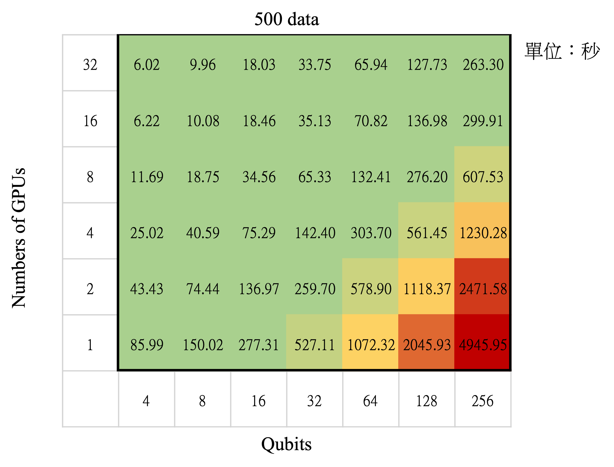

# cutn-qsvm_benchmark
demo code for cutn-qsvm_benchmark with h100 cluster

## 0. Create Envirement and Requirement

## 1. Run Benchmark Code
### For 1 node with 8 GPUs
sbatch benchmark_mgpu_g08.slurm 

output

### For 4 node with 32 GPUs
sbatch benchmark_mgpu_g32.slurm 

output 

## 2. Previous Result
